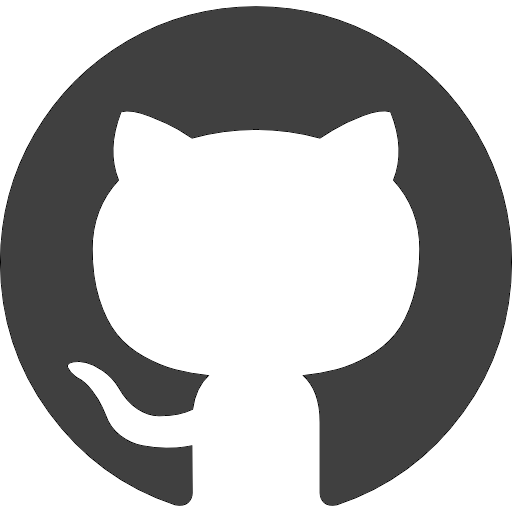
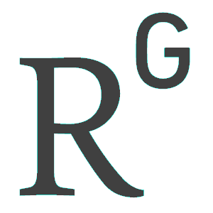



Department of Statistical Sciences  
University of Padova 
Via Cesare Battisti 241  
35121 Padova, Italy 

 

<b>Email:</b>  

 <a href="" onclick="myFunction()"> laura.dangelo.1@phd.unipd.it </a>
  Copy to clipboard

  
dangelo@stat.unipd.it

 

